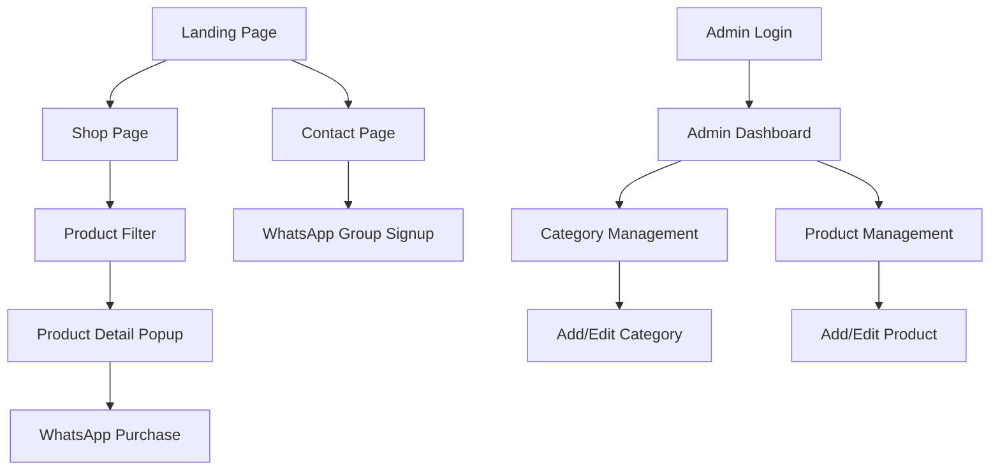

## 1. Product Overview
Eterna is a natural skincare brand's online store with an integrated admin panel for product management. The platform enables customers to browse and inquire about skincare products while providing administrators with comprehensive tools to manage inventory and customer interactions.

The system solves the problem of managing an online skincare product catalog with WhatsApp-based customer communication, targeting skincare enthusiasts who prefer natural products and direct communication channels for purchases.

## 2. Core Features

### 2.1 User Roles
| Role | Registration Method | Core Permissions |
|------|---------------------|------------------|
| Customer | No registration required | Browse products, view details, contact via WhatsApp |
| Admin | Secure login with credentials | Manage products, categories, view dashboard analytics |

### 2.2 Feature Module
The Eterna skincare web app consists of the following main pages:
1. **Landing page**: Hero section, brand story, featured products showcase
2. **Shop page**: Product filtering sidebar, product grid display with pagination
3. **Product detail popup**: Product information, image gallery, WhatsApp purchase integration
4. **Contact page**: Business information, WhatsApp group signup form
5. **Admin login page**: Secure authentication for administrators
6. **Admin dashboard**: Category and product analytics overview
7. **Category management**: Add/edit product categories
8. **Product management**: Add/edit products with category assignment and image uploads

### 2.3 Page Details
| Page Name | Module Name | Feature description |
|-----------|-------------|---------------------|
| Landing page | Hero section | Display brand messaging with automatic image carousel showcasing natural skincare benefits |
| Landing page | About us | Present brand story, mission, and natural ingredients philosophy |
| Landing page | Featured products | Showcase 4-6 highlighted products with quick view functionality |
| Shop page | Filter sidebar | Filter products by category with checkbox selection, price range, and skin type |
| Shop page | Product grid | Display products in responsive grid layout with pagination (12 products per page) |
| Shop page | Product cards | Show product image, name, price, and quick view button |
| Product detail popup | Image gallery | Display up to 3 product images with zoom functionality |
| Product detail popup | Product info | Show name, price, description, ingredients, usage instructions |
| Product detail popup | WhatsApp integration | One-click WhatsApp button to inquire about product with pre-filled message |
| Contact page | Business info | Display store hours, location, contact details |
| Contact page | WhatsApp signup | Form to join customer WhatsApp group for updates and promotions |
| Admin login | Authentication | Secure login form with email/password validation |
| Admin dashboard | Analytics cards | Display total categories, total products, recent activity |
| Admin dashboard | Quick actions | Quick links to add category, add product, view all products |
| Category management | Category list | Table view of all categories with edit/delete actions |
| Category management | Add/edit form | Form with category name, description, and status toggle |
| Product management | Product list | Table view of all products with search and filter options |
| Product management | Add/edit form | Form with product details, category selection, and image upload (max 3) |
| Product management | Image upload | Drag-and-drop image upload with preview and delete functionality |

## 3. Core Process

### Customer Flow
1. Customer lands on homepage and views featured products
2. Customer navigates to shop page to browse all products
3. Customer uses filters to narrow down product selection
4. Customer clicks on product to view detailed information in popup
5. Customer uses WhatsApp integration to inquire about purchase
6. Customer can join WhatsApp group for updates via contact page

### Admin Flow
1. Admin accesses login page and enters credentials
2. Admin views dashboard with key metrics
3. Admin manages categories (add, edit, delete)
4. Admin manages products with images and category assignments
5. Admin monitors customer inquiries through WhatsApp

## 4. User Interface Design

### 4.1 Design Style
- **Primary colors**: Sage green (#87A96B), Cream white (#F5F5DC)
- **Secondary colors**: Soft brown (#8B4513), Natural beige (#F5DEB3)
- **Button style**: Rounded corners with subtle shadow, hover effects
- **Font**: Clean sans-serif (Inter or similar), 16px base size
- **Layout style**: Card-based design with generous whitespace
- **Icons**: Natural-themed icons (leaves, flowers, organic shapes)

### 4.2 Page Design Overview
| Page Name | Module Name | UI Elements |
|-----------|-------------|-------------|
| Landing page | Hero section | Full-width carousel with natural skincare imagery, overlay text with call-to-action |
| Landing page | About us | Two-column layout with brand story text and natural ingredients imagery |
| Landing page | Featured products | Horizontal card slider with product images, names, and quick view buttons |
| Shop page | Filter sidebar | Sticky left sidebar with collapsible filter sections, green accent colors |
| Shop page | Product grid | Responsive 3-column grid on desktop, 2-column on tablet, 1-column on mobile |
| Product detail popup | Modal overlay | Centered modal with image gallery on left, product details on right |
| Contact page | Contact form | Clean form layout with WhatsApp integration button prominently displayed |
| Admin dashboard | Analytics cards | Grid of metric cards with icons and numbers, clean card design |
| Admin forms | Form inputs | Consistent form styling with green accent borders and validation states |

### 4.3 Responsiveness
- **Desktop-first design**: Optimized for 1920px width
- **Mobile adaptation**: Responsive breakpoints at 768px and 480px
- **Touch optimization**: Larger tap targets for mobile devices
- **Flexible grid system**: Adapts from 3-column to single-column layout