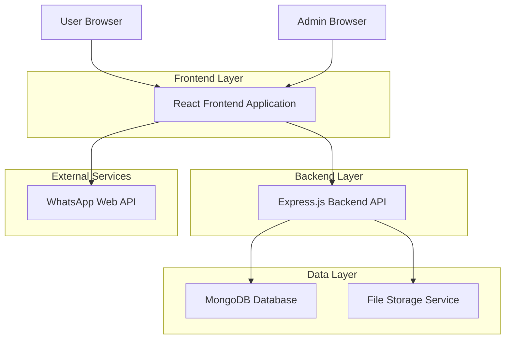
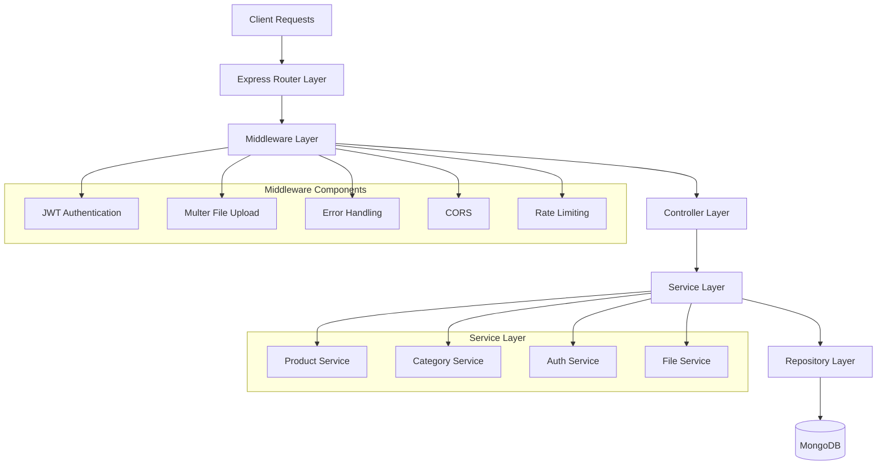
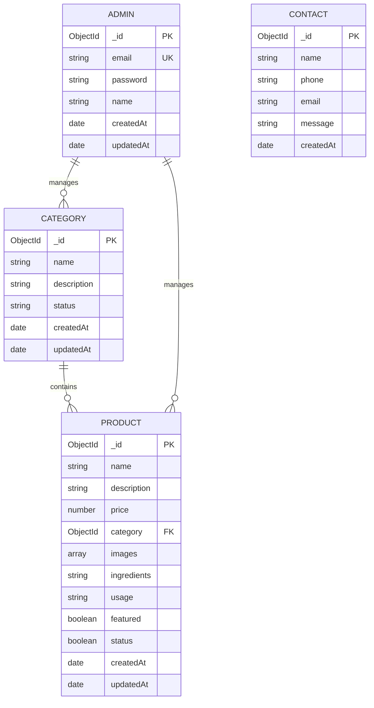

## 1. Architecture Design



## 2. Technology Description
- **Frontend**: React@18 + tailwindcss@3 + vite
- **Backend**: Express@4 + Node.js@18
- **Database**: MongoDB@6 with Mongoose ODM
- **File Storage**: Local filesystem with multer middleware
- **Authentication**: JWT-based authentication for admin panel
- **Communication**: WhatsApp Business API integration

## 3. Route Definitions

### Frontend Routes
| Route | Purpose |
|-------|---------|
| / | Landing page with hero section and featured products |
| /shop | Product catalog with filtering and pagination |
| /contact | Contact information and WhatsApp group signup |
| /admin/login | Admin authentication page |
| /admin/dashboard | Admin dashboard with analytics |
| /admin/categories | Category management interface |
| /admin/products | Product management interface |
| /admin/products/add | Add new product form |
| /admin/products/edit/:id | Edit existing product form |

### API Routes
| Route | Method | Purpose |
|-------|--------|---------|
| /api/auth/login | POST | Admin login authentication |
| /api/auth/verify | GET | Verify JWT token validity |
| /api/categories | GET | Fetch all categories |
| /api/categories | POST | Create new category |
| /api/categories/:id | PUT | Update category |
| /api/categories/:id | DELETE | Delete category |
| /api/products | GET | Fetch products with pagination and filters |
| /api/products | POST | Create new product with images |
| /api/products/:id | GET | Fetch single product details |
| /api/products/:id | PUT | Update product with images |
| /api/products/:id | DELETE | Delete product and associated images |
| /api/upload | POST | Upload product images |
| /api/contact/whatsapp-group | POST | Join WhatsApp group |

## 4. API Definitions

### 4.1 Authentication API

**Admin Login**
```
POST /api/auth/login
```

Request:
| Param Name | Param Type | isRequired | Description |
|------------|------------|------------|-------------|
| email | string | true | Admin email address |
| password | string | true | Admin password |

Response:
| Param Name | Param Type | Description |
|------------|------------|-------------|
| success | boolean | Authentication status |
| token | string | JWT token for authenticated sessions |
| admin | object | Admin user details (excluding password) |

Example:
```json
{
  "email": "admin@eterna.com",
  "password": "securePassword123"
}
```

### 4.2 Product Management API

**Create Product**
```
POST /api/products
```

Request:
| Param Name | Param Type | isRequired | Description |
|------------|------------|------------|-------------|
| name | string | true | Product name |
| description | string | true | Product description |
| price | number | true | Product price |
| category | string | true | Category ID |
| ingredients | string | false | Product ingredients |
| usage | string | false | Usage instructions |
| images | array | false | Array of image filenames |
| featured | boolean | false | Featured product flag |

Response:
| Param Name | Param Type | Description |
|------------|------------|-------------|
| success | boolean | Operation status |
| product | object | Created product details |

### 4.3 Category Management API

**Create Category**
```
POST /api/categories
```

Request:
| Param Name | Param Type | isRequired | Description |
|------------|------------|------------|-------------|
| name | string | true | Category name |
| description | string | false | Category description |
| status | string | true | Category status (active/inactive) |

## 5. Server Architecture Diagram



## 6. Data Model

### 6.1 Data Model Definition



### 6.2 Data Definition Language

**Categories Collection**
```javascript
const categorySchema = new mongoose.Schema({
  name: {
    type: String,
    required: true,
    trim: true,
    maxlength: 100
  },
  description: {
    type: String,
    trim: true,
    maxlength: 500
  },
  status: {
    type: String,
    enum: ['active', 'inactive'],
    default: 'active'
  }
}, {
  timestamps: true
});
```

**Products Collection**
```javascript
const productSchema = new mongoose.Schema({
  name: {
    type: String,
    required: true,
    trim: true,
    maxlength: 200
  },
  description: {
    type: String,
    required: true,
    trim: true,
    maxlength: 2000
  },
  price: {
    type: Number,
    required: true,
    min: 0
  },
  category: {
    type: mongoose.Schema.Types.ObjectId,
    ref: 'Category',
    required: true
  },
  images: [{
    type: String,
    maxlength: 500
  }],
  ingredients: {
    type: String,
    trim: true,
    maxlength: 1000
  },
  usage: {
    type: String,
    trim: true,
    maxlength: 500
  },
  featured: {
    type: Boolean,
    default: false
  },
  status: {
    type: String,
    enum: ['active', 'inactive'],
    default: 'active'
  }
}, {
  timestamps: true
});
```

**Admins Collection**
```javascript
const adminSchema = new mongoose.Schema({
  email: {
    type: String,
    required: true,
    unique: true,
    lowercase: true,
    trim: true
  },
  password: {
    type: String,
    required: true,
    minlength: 6
  },
  name: {
    type: String,
    required: true,
    trim: true,
    maxlength: 100
  }
}, {
  timestamps: true
});
```

### 6.3 File Upload Configuration

**Multer Configuration**
```javascript
const storage = multer.diskStorage({
  destination: function (req, file, cb) {
    const uploadPath = path.join(__dirname, '../uploads/products');
    cb(null, uploadPath);
  },
  filename: function (req, file, cb) {
    const uniqueSuffix = Date.now() + '-' + Math.round(Math.random() * 1E9);
    cb(null, file.fieldname + '-' + uniqueSuffix + path.extname(file.originalname));
  }
});

const fileFilter = (req, file, cb) => {
  const allowedTypes = ['image/jpeg', 'image/jpg', 'image/png', 'image/webp'];
  if (allowedTypes.includes(file.mimetype)) {
    cb(null, true);
  } else {
    cb(new Error('Invalid file type. Only JPEG, PNG, and WebP images are allowed.'), false);
  }
};

const upload = multer({
  storage: storage,
  limits: {
    fileSize: 5 * 1024 * 1024 // 5MB limit
  },
  fileFilter: fileFilter
});
```

### 6.4 Authentication Configuration

**JWT Configuration**
```javascript
const jwtConfig = {
  secret: process.env.JWT_SECRET || 'your-secret-key',
  expiresIn: '24h',
  refreshExpiresIn: '7d'
};

// Middleware for protecting routes
const authenticateToken = (req, res, next) => {
  const authHeader = req.headers['authorization'];
  const token = authHeader && authHeader.split(' ')[1];
  
  if (!token) {
    return res.status(401).json({ success: false, message: 'Access token required' });
  }
  
  jwt.verify(token, jwtConfig.secret, (err, user) => {
    if (err) {
      return res.status(403).json({ success: false, message: 'Invalid or expired token' });
    }
    req.user = user;
    next();
  });
};
```

## 7. Project Structure

```
eterna-skincare/
├── client/                     # React frontend
│   ├── public/
│   ├── src/
│   │   ├── components/
│   │   │   ├── common/
│   │   │   ├── landing/
│   │   │   ├── shop/
│   │   │   ├── admin/
│   │   │   └── contact/
│   │   ├── pages/
│   │   ├── services/
│   │   ├── hooks/
│   │   ├── utils/
│   │   ├── styles/
│   │   └── App.js
│   └── package.json
├── server/                     # Express backend
│   ├── config/
│   ├── controllers/
│   ├── models/
│   ├── routes/
│   ├── middleware/
│   ├── services/
│   ├── uploads/
│   └── server.js
├── shared/                     # Shared utilities
└── package.json
```